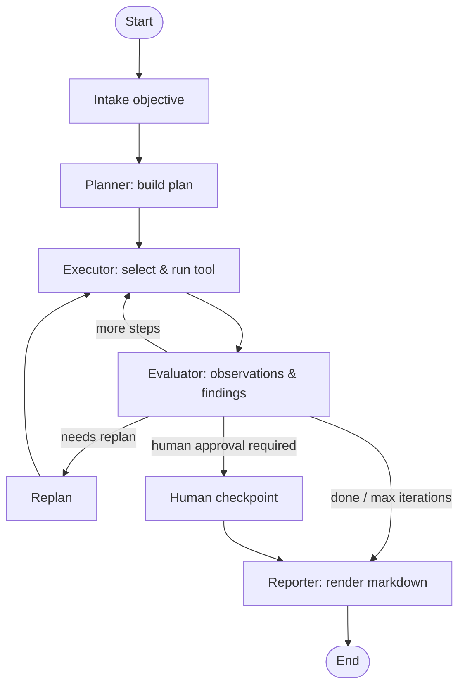

# HexAgent

**HexAgent** is an educational proof-of-concept that demonstrates how an AI agent
can *orchestrate* web-application reconnaissance using
[LangGraph](https://github.com/langchain-ai/langgraph) and
[LangChain](https://github.com/langchain-ai/langchain). It plans, selects and runs
tools, evaluates results, replans when needed, and produces a markdown report.

> ⚠️ **Educational use only.** Every tool is a **deterministic mock** — HexAgent
> performs **no real network activity and no exploitation**. It is designed as a
> foundation for learning (e.g. TryHackMe-style content) and for safely extending
> toward real, *authorised* tooling later. Only ever target systems you own or are
> explicitly permitted to test.

---

## Features

- 🧠 **Agentic LangGraph workflow** — objective → plan → execute → evaluate →
  (replan) → report, with iterative looping.
- 🧩 **Modular, SOLID architecture** — clean separation of models, tools, planners,
  agents, prompts, graph and utilities.
- 🛠️ **Pluggable tool registry** — eight mock recon tools returning structured
  Pydantic models; add real tools without touching the orchestration layer.
- 🔁 **Iterative control flow** — stops when the goal is met, the iteration budget
  is exhausted, or human approval is required.
- 🤖 **LLM-optional** — runs fully offline with deterministic heuristic agents;
  drop in any OpenAI-compatible endpoint to enable LLM-driven planning/evaluation.
- 📄 **Markdown reports** — objective, plan, executed steps, tool outputs, findings,
  suggested next actions and human-validation points.
- ✅ **Tested & linted** — pytest suite plus ruff configuration.

---

## Architecture

HexAgent is layered so that each concern is independently testable and replaceable:

| Layer | Package | Responsibility |
|-------|---------|----------------|
| Models | `app/models` | Pydantic contracts: `Plan`, `PlanStep`, `ToolCall`, `ToolResult`, `Finding`, `Report`. |
| Tools | `app/tools` | `BaseTool` abstraction, `ToolRegistry`, and the mock tools. |
| Planners | `app/planners` | `HeuristicPlanner` (offline) and `LLMPlanner` behind a `BasePlanner` interface. |
| Agents | `app/agents` | Planner / Executor / Evaluator / Reporter reasoning units. |
| Prompts | `app/prompts` | Prompt **text files** + a loader (no hardcoded prompts). |
| Graph | `app/graph` | `AgentState`, nodes, router and the compiled LangGraph workflow. |
| Utils | `app/utils` | Logging, LLM factory, JSON parsing, report persistence. |

### Graph workflow



The routing predicate (`app/graph/router.py`) decides the next hop after each
evaluation in this priority order:

1. **Iteration budget exhausted** → report.
2. **Replan requested** by the evaluator → replan, then continue executing.
3. **Runnable steps remain** → execute the next step.
4. **Human approval configured** → human checkpoint (a terminal pause that still
   emits a report for review).
5. Otherwise → report.

### State

`AgentState` (a Pydantic model) is threaded through every node and tracks the
`objective`, `target`, current `plan`, `completed_step_ids`, accumulated
`observations`, `findings`, `tool_results`, `executed_steps`, `reasoning_history`,
plus control-flow fields (`iterations`, `needs_replan`, `replans`,
`awaiting_human`, `stopped_reason`) and outputs (`report`, `report_markdown`).

---

## Project structure

```
HexAgent/
├── app/
│   ├── agents/        # planner / executor / evaluator / reporter agents
│   ├── graph/         # state, nodes, router, compiled workflow
│   ├── models/        # Pydantic models (plan, tool IO, findings, report)
│   ├── planners/      # heuristic + LLM planners behind a base interface
│   ├── prompts/       # prompt loader + templates/*.txt
│   ├── tools/         # BaseTool, registry, mock tools, deterministic fixtures
│   ├── utils/         # logging, LLM factory, parsing, report IO
│   ├── cli.py         # command-line interface
│   └── config.py      # pydantic-settings configuration
├── examples/          # runnable programmatic example
├── tests/             # pytest suite
├── docs/              # architecture notes
├── main.py            # thin launcher -> app.cli:main
├── pyproject.toml
└── .env.example
```

---

## Installation

Requires **Python 3.12+** and [`uv`](https://github.com/astral-sh/uv).

```bash
uv sync --extra dev      # create the venv and install all dependencies
cp .env.example .env     # then paste your Vercel AI Gateway key (works without one)
```

Set `AI_GATEWAY_API_KEY` in `.env` to enable LLM-driven agents via the Vercel AI
Gateway; leave it empty to run fully offline in deterministic mock mode.

---

## Configuration

All settings are environment variables (see `.env.example`). HexAgent is
pre-configured for the [Vercel AI Gateway](https://vercel.com/docs/ai-gateway)
(an OpenAI-compatible endpoint). With **no API key**, it runs in deterministic
**mock mode**.

| Variable | Default | Description |
|----------|---------|-------------|
| `AI_GATEWAY_API_KEY` | _empty_ | Vercel AI Gateway key; enables LLM agents when set. `OPENAI_API_KEY` is also accepted. |
| `OPENAI_BASE_URL` | `https://ai-gateway.vercel.sh/v1` | OpenAI-compatible base URL (override for other hosts). |
| `HEXAGENT_MODEL` | `openai/gpt-4o-mini` | Model id in `provider/model` format (e.g. `anthropic/claude-sonnet-4.6`). |
| `HEXAGENT_MOCK_MODE` | `false` | Force offline determinism. |
| `HEXAGENT_ENABLE_NMAP` | `false` | Register the real `nmap_scan` tool (shells out to a local `nmap` binary). Only enable against explicitly authorised targets. |
| `HEXAGENT_MAX_ITERATIONS` | `12` | Iteration budget before halting. |
| `HEXAGENT_REQUIRE_HUMAN_APPROVAL` | `false` | Pause for human review before the report. |
| `HEXAGENT_LOG_LEVEL` | `INFO` | Logging level. |
| `HEXAGENT_REPORT_DIR` | `reports` | Output directory for reports. |

---

## Usage

### CLI

```bash
# Offline, deterministic run; print the report to stdout
uv run hexagent --objective "Recon the lab box" --target demo.thm.local --mock --print

# Cap iterations and require a human approval checkpoint
uv run hexagent -o "Map the attack surface" -t example.thm --max-iterations 6 --human-approval
```

> **macOS troubleshooting:** if `uv run hexagent` raises
> `ModuleNotFoundError: No module named 'app'`, some `uv` versions write the
> editable-install `.pth` file with the macOS hidden flag set, which
> Python 3.12+'s `site.py` silently skips. Run via the module instead — it
> isn't affected by that `.pth`:
>
> ```bash
> uv run python -m app.cli --objective "Recon the lab box" --target demo.thm.local --mock --print
> ```

Reports are written to `reports/` unless `--no-save` is passed.

### Programmatic

```python
from app.graph.workflow import run_workflow

state = run_workflow("Passive reconnaissance", "demo.thm.local")
print(state.report_markdown)
```

### Example script

```bash
uv run python examples/basic_recon.py
```

---

## How it works

- **Planner** turns the objective into an ordered `Plan`. Offline it emits a
  canonical recon recipe (fingerprint → headers → security headers → robots.txt →
  crawl → summarise); with an LLM it requests a structured JSON plan and falls
  back to the heuristic plan on any error.
- **Executor** picks the tool for the next runnable step (honouring step
  dependencies) and runs it via the `ToolRegistry`.
- **Evaluator** converts the raw `ToolResult` into neutral `Observation`s and
  interpreted `Finding`s, flags items needing human validation, and may request a
  replan (e.g. when `robots.txt` reveals interesting paths).
- **Reporter** renders the final markdown report. The deterministic renderer
  guarantees the required section structure; an LLM, if present, adds an executive
  summary on top.

---

## Extensibility

The architecture is intentionally open for extension without modifying the
orchestration layer:

- **Add a real tool** (Nmap, Nuclei, ffuf, SQLMap, Burp): subclass `BaseTool`,
  implement `_run`, return a structured `ToolResult`, and register it in
  `default_registry()`. Planner/executor pick it up automatically via the catalogue.
- **Browser automation**: wrap a Playwright session as a tool subclass.
- **Multi-agent workflows**: add new nodes/agents and wire extra edges in
  `app/graph/workflow.py`; the router pattern scales to more destinations.
- **Human-in-the-loop**: the `human` checkpoint node is the seam for a real
  LangGraph `interrupt`/approval gate.
- **Memory / RAG**: inject a retriever into the agents and persist
  `reasoning_history` to a vector store; add a checkpointer to `compile()`.

---

## Testing

```bash
uv run pytest            # run the suite (offline, deterministic)
uv run ruff check .      # lint
uv run ruff format .     # format
```

---

## Limitations

This is a proof-of-concept, not a production pentesting tool. Known boundaries:

- **Mock-by-default tooling.** All eight built-in tools return deterministic,
  simulated data derived from a per-target fixture profile — no real HTTP
  requests, port scans, crawling or fingerprinting occur. `nmap_scan` is the
  only real, network-touching tool, and it is opt-in (`HEXAGENT_ENABLE_NMAP`),
  off by default.
- **No exploitation capability.** There is no payload delivery, credential
  testing, injection, or post-exploitation logic of any kind — by design.
- **No authenticated/session-aware testing.** Tools operate statelessly per
  call; there's no cookie jar, login flow, or multi-step session handling.
- **Single target, single run.** No multi-host campaigns, asset inventory, or
  cross-run scope management; each invocation assesses one target in isolation.
- **No persistence across runs.** `AgentState` lives in memory for the
  duration of one `run_workflow()` call; there's no checkpointing, resumption,
  or run history (the `report_dir` only stores the rendered markdown).
- **Heuristic planning is fixed, LLM planning is best-effort.** Offline, the
  planner always emits the same canonical recon recipe. With an LLM, planning
  and tool selection can fail or hallucinate; failures fall back to the
  heuristic path silently, which is good for robustness but means an LLM-driven
  run's "reasoning" isn't guaranteed to differ from the offline default.
- **Replanning is narrow.** The only built-in replan trigger is "robots.txt
  revealed an interesting path"; it does not generalise to arbitrary
  evaluator-driven strategy changes.
- **Findings are illustrative, not a vulnerability scanner.** Severity grading
  (e.g. the security-headers letter grade) is a simple heuristic for teaching
  purposes, not a calibrated risk assessment, and isn't mapped to any
  standard (OWASP, CVSS, PTES).
- **No rate limiting or scope enforcement on real tools.** `nmap_scan`
  validates input against command-injection but does not restrict *which*
  hosts it may target (e.g. to a private-IP allowlist) — authorisation is the
  operator's responsibility, not something the code enforces.

## Further reading

See [`docs/architecture.md`](docs/architecture.md) for a deeper component
breakdown and design rationale, and
[`docs/training-use-case.md`](docs/training-use-case.md) for how this POC maps
to a professional training module and a suggested team walkthrough agenda.

## Disclaimer

This project is an educational proof-of-concept built around **simulated** tools.
It is **not** a penetration-testing product and must not be used against systems
without explicit authorisation. Always follow applicable laws and the rules of
engagement for any lab or target.
